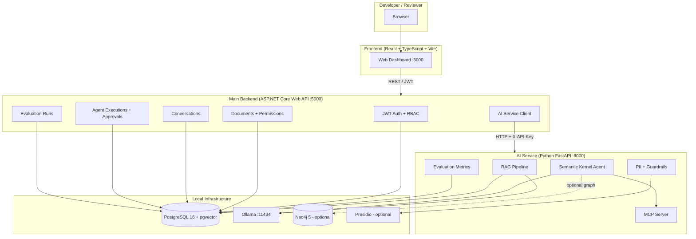
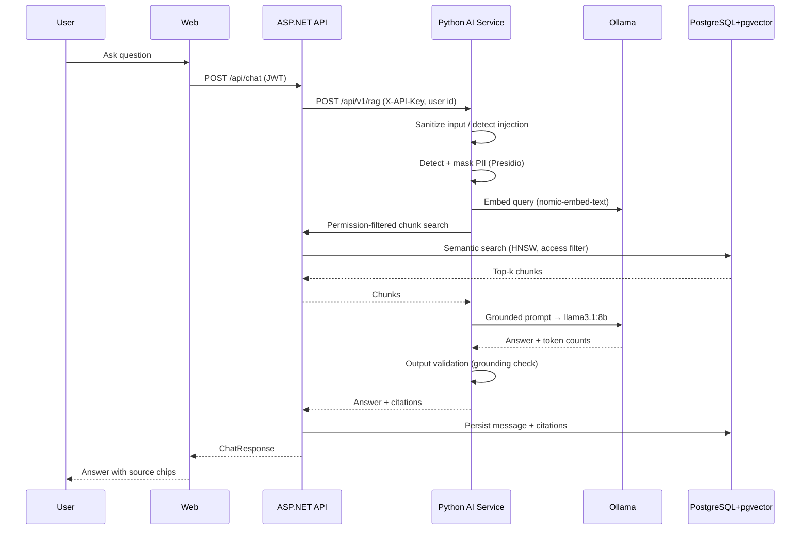
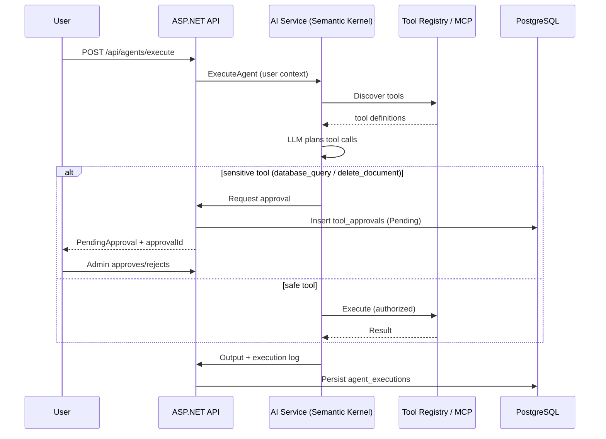

# Architecture Diagram

## System Context

```mermaid
flowchart TB
    subgraph User["Developer / Reviewer"]
        Browser[Browser]
    end

    subgraph Frontend["Frontend (React + TypeScript + Vite)"]
        Web[Web Dashboard :3000]
    end

    subgraph Backend["Main Backend (ASP.NET Core Web API :5000)"]
        Auth[JWT Auth + RBAC]
        Docs[Documents + Permissions]
        Chat[Conversations]
        Agents[Agent Executions + Approvals]
        Eval[Evaluation Runs]
        SvcClient[AI Service Client]
    end

    subgraph AI["AI Service (Python FastAPI :8000)"]
        RAG[RAG Pipeline]
        SK[Semantic Kernel Agent]
        MCP[MCP Server]
        Guard[PII + Guardrails]
        EvalAI[Evaluation Metrics]
    end

    subgraph LocalInfra["Local Infrastructure"]
        PG[(PostgreSQL 16 + pgvector)]
        Ollama[Ollama :11434]
        Neo4j[(Neo4j 5 - optional)]
        Presidio[Presidio - optional]
    end

    Browser --> Web
    Web -->|REST / JWT| Backend
    Auth --> PG
    Docs --> PG
    Chat --> PG
    Agents --> PG
    Eval --> PG
    SvcClient -->|HTTP + X-API-Key| AI
    RAG --> Ollama
    SK --> Ollama
    SK --> MCP
    Guard --> Presidio
    RAG --> PG
    EvalAI --> PG
    SK -.optional graph.-> Neo4j
```

## RAG Request Flow

```mermaid
sequenceDiagram
    participant U as User
    participant W as Web
    participant A as ASP.NET API
    participant AI as Python AI Service
    participant O as Ollama
    participant D as PostgreSQL+pgvector

    U->>W: Ask question
    W->>A: POST /api/chat (JWT)
    A->>AI: POST /api/v1/rag (X-API-Key, user id)
    AI->>AI: Sanitize input / detect injection
    AI->>AI: Detect + mask PII (Presidio)
    AI->>O: Embed query (nomic-embed-text)
    AI->>A: Permission-filtered chunk search
    A->>D: Semantic search (HNSW, access filter)
    D-->>A: Top-k chunks
    A-->>AI: Chunks
    AI->>O: Grounded prompt → llama3.1:8b
    O-->>AI: Answer + token counts
    AI->>AI: Output validation (grounding check)
    AI-->>A: Answer + citations
    A->>D: Persist message + citations
    A-->>W: ChatResponse
    W-->>U: Answer with source chips
```

## Agent Tool-Call Flow

```mermaid
sequenceDiagram
    participant U as User
    participant A as ASP.NET API
    participant AI as AI Service (Semantic Kernel)
    participant T as Tool Registry / MCP
    participant D as PostgreSQL

    U->>A: POST /api/agents/execute
    A->>AI: ExecuteAgent (user context)
    AI->>T: Discover tools
    T-->>AI: tool definitions
    AI->>AI: LLM plans tool calls
    alt sensitive tool (database_query / delete_document)
        AI->>A: Request approval
        A->>D: Insert tool_approvals (Pending)
        A-->>U: PendingApproval + approvalId
        U->>A: Admin approves/rejects
    else safe tool
        AI->>T: Execute (authorized)
        T-->>AI: Result
    end
    AI->>A: Output + execution log
    A->>D: Persist agent_executions
```
